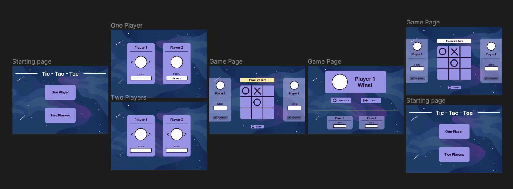

# Tic - Tac - Toe Game
&nbsp; 
## How To Play:
1. Start by customising your avatar by shuffling between the arrows next to it.
2. Player 1 begins their move by clicking on any tile on the game board.
3. After Player 1 makes a move, it is Player 2's turn to make a move.
4. Keep track of the message prompt and alternate between each player.
5. The player who manages to get any of their pieces in a straight line of 3 tiles wins!
6. You can either restart the game, reset the score or do both by clicking on the buttons below the game board at any point.

&nbsp; 

---
&nbsp; 
### Design and Development Process
&nbsp;  

**DESIGN PHASE**

1. Concept designs were created using Figma, revolving around the theme of space.

2.  Multiple pages were created which includes:
> - The landing page (users are able to play between a bot or with another player)
> - The player customisation page (users are able to customise their avatar and name)
> - The main game page (users are able to play Tic - Tac - Toe)
> - The winner page (the player who wins is celebrated and users are able to either play again or exit the game)

&nbsp;  
**DEVELOPMENT PHASE**

1. Began coding static pages using HTML and CSS, following the designs on Figma.
2. Due to the time constraints, I have decided to only include the main game page in the final version and include or omit some of the other pages' features around it.
3. The features included were coded in Javascript and consisted of:
> - Avatar customisation 
> - Player cards with the player's information and a score tracker 
> - A message prompt bar 
> - A restart game button 
> - A reset score button 
> - Audio effects

4. The features that were omitted from the original design consisted of:
> - Playing against a bot (Due to time constraint, the intended development of an AI opponent was discarded)
> - An exit button (it was unnecessary to include)

&nbsp; 

Detailed process:

1. Found a space image on Google and used it as a background image for the page.
2. Created the game board with 9 different tiles arranged in a 3x3.
3. Added hover states for each tile, changing it to a lighter colour if the cursor is hovered over it.
4. Created the player cards with an avatar, the player name, their Tic -Tac -Toe piece and their score.
5. Added the option for users to switch between different avatars.
6. Implemented a scoreboard that increases whenever the player wins.
7. Implemented a message prompt bar that changes based on which player's turn it is, which player won or if the game results in a draw. The winning or draw message changes the color or the prompt bar.
8. Created a restart game button that removes all of the X and O pieces on the board and resets the message prompt to the begin with Player 1's turn.
9. Created a reset score button that resets the existing scores of both players back to 0.
10. Changed the cursor to a pointer on elements that users are able to click on.
11. Added 3 different audio effects for when the user places their piece on the game board, if a player wins and if the game draws.

&nbsp; 

Unique technical methods used:

*HTML*
- `<audio></audio>` tag (to be able to play audio based on certain conditions)

*CSS*
- element:hover (the game board tiles, restart game button and reset score button)

*Javascript*
- `setTimeout()` method (to put a 80 millisecond delay when changing the message prompt, score and winning audio)
- `audio.volume` DOM Property (to lower the volume of the audio being played since the raw files were a little too loud)

&nbsp; 

---
&nbsp; 
### Potential Fixes
&nbsp; 

*HTML*
- A lot of divs were used to structure the page elements which includes nesting divs in other divs and other more semantic elements could be used to represent the content in these divs more clearly and effectively.

*Javascript*
-  The winning logic that has been implemented is repeated many times and a shorter and more efficient way to implement it could be used in the future.
